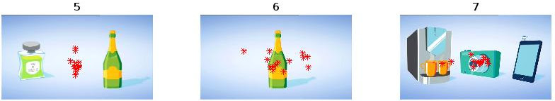

# Gaze Prediction -- Preliminary Report
#### Alexander Höreth ([ahoereth@uos.de](mailto:ahoereth@uos.de)), 2016/10/24

## Visual Attention
The term attention describes the state of mind when one focuses on specific sensory inputs. While one can not only attend to visual but also auditory or olfactory perceptions, the following will only focus on the former.

> In order for the mind to become conscious of perceive objects, and therefore for the act of apperception, attention is required.
> --- Leibnitz (1765)

### Covert attention (Helmholtz)
Traditionally research focussed on overt attention when talking about visual attention. With overt attentions subjects physically shift their point of view onto target objects. Using a rather simple experiment Helmholtz prove the existence of a second way of attention: covert attention. In the self conducted experiment Helmholtz physically focused his eyes on solely illuminated pinhole on a otherwise completely dark sheet of paper. Using a quick electric flash of light the letters on the dark sheet were illuminated for a shortest amount of time. The illumination was so short the subject was unable to physically move its eyes. Although not able to overtly attend, subjects were able to still perceive letters by covertly focusing on a specific spot of the dark area beforehand -- eyes still on the pinhole. Only those characters overtly focused on in the subjects mind were perceived, even those close to the physical point of overt attention remained unknown.

> I found myself able to choose in advance which part of the dark field off to the side of the constantly fixated pinhole I wanted to perceive by indirect vision. Consequently, during the electrical illumination, I in fact perceived several groups of letters in that region of the field. The letters in most of the remaining part of the field, however, had not reached perception, not even those that were close to the point of fixation.
> --- von Helmholtz (1896)

Similar to this result and more commonly observable in everyday life is the also by Helmholtz described ability to physically focus the eyes on the letter `r` in the word `horse` but still perceive the letters `h`, `o`, `s` and `e`.

### Early Selection (Broadbent)
Later on in the midst of the 19th century researchers interest shifted from describing subjects behaviour to discussing the underlying processes of such an observed behaviour. One famous example which still nowadays proves to be topic of interest is the *cocktail party effect*: Subjects are exposed to individual audio streams on each ear and asked to focus on a specific one. Afterwards the subject would be questioned about the unattended stream.

In order to explain the somehow occurring filtering two trains of though are predominant: Early and late selection. In *early selection* incoming sensory information (e.g. auditory or visual) is filtered by physical properties like for example naturally occurring similarities in the stream. Shifting attention in this concept requires significant effort because this pre-processing filter has to be adjusted. In contrast to *early selection* all information is expected to be processed in the *late selection* concept. Here the filtering occurs at a later point using memory representations in the brain. Due to problems like how one commonly reacts to his personal name although spoken seemingly out of hearing range the late selection concept nowadays is more accepted.

### Eye Tracking (Yarbus)
Further investigating how subjects direct their attention Yarbus specifically studied eye movements. He recorded subjects eye movements while viewing images or natural scenes. He came to the conclusion that there indeed, as maybe suggested intuitively, is a strong relation between where subjects direct their gaze and what they focus their attention on. Yarbus was able to manipulate this by asking specific questions which resulted in subjects repetitively focussing their gaze on relevant areas of the image.

### Feature Integration Theory (Triesman)
The feature integration theory describes a two step process for perception.

1. In the first so called *preattentive* stage general features of the stimulus are unconsciously and therefore effortlessly perceived. Those features for a visual stimulus might for example contain color, motion and shapes.
2. In the second, the focused attention stage, features are combined to individual objects when one directs his or her attention to them -- this is called feature integration.

Due to the unconscious nature of the feature detection from the first stage it is, according to Triesman, possible to very quickly filter for objects of interest by their general features before actually having to actively attend to them in phase two.

### Exogenous and endogenous attention
The terms exogenous and endogenous refer to external or internal control processes, respectively. Exogenous attention control processes are considered to be reflexive and therefore mostly not controllable by the subject. They can for example be triggered by sudden changes in the peripheral visual area, for example light flashes or quick movements. In contrast to such reflexive reactions endogenous control processes are intentional and require wilful decisions.

## Gaze Plotting
In figure 1 and 2 the 7 fixation point sets are plotted onto their respective stimuli images. As we do not know under which circumstances the fixations were recorded there are different possibilities for the results and their discrepancies. For the images 1 to 4 (figure 1) it seems like subjects were asked to determine brand names -- as demonstrated by Yarbus relevant questions influence subjects gaze.

The results for image 5 (figure 2) seem inconclusive: Either the fixation data set is labelled incorrectly (it might instead be related to the single bottle from image 6) or the fixations were recorded too early or late and are focussed on the center due to a fixation cross from the experiment design, the background noise or a transition from/to another image. Another possibility might be that the data is averaged: When an equal amount of focus lies on the left as on the right object, the average could result in the data on hand.

> Guess, how many viewers in the experiment?
