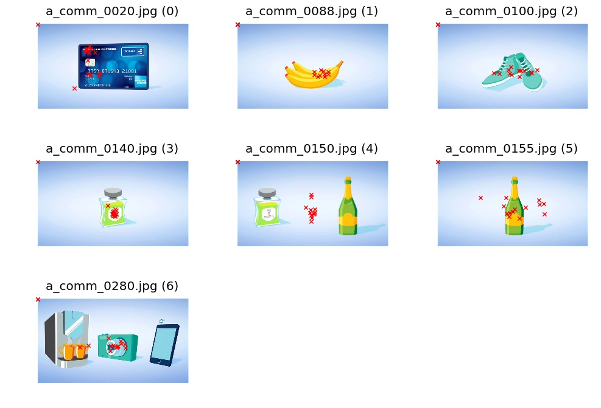

% Programming Report
% Sebastian Höffner
% October 26, 2016

# Results

For the task there were only seven sets of fixation coordinates provided, thus three images had to be excluded from the analysis.
Most fixations seem to be at locations where one would expect logos or brands of the items depicted in the viewed images, in other
words at locations where there seems to be more information (e.g. through corners and edges).

# Outliers

## (0, 0)

Each image has a `(0, 0)` coordinate. This might be a technical issue (padding of values, default value for empty sets, ...).
However, the `(0, 0)` origin allows to check if the orientation of the fixation plot fits the image: it has to be in the upper
left corner of the image. In Figure 1 one can clearly observe that this is the case.

## Image (4), perfume and bottle

This image shows all fixation points between the depicted items, instead of somewhere on the two items. A possible explanation
is that for the study the images were shown for a short amount of time only, while the participants had to focus on a fixation
cross in the center of the screen in between. This way it is possible that since there are two items, the participants did
not choose between them in the time available, resulting in an unfocused fixation on the center.

Other possible explanations depend on the data interpretation with respect to the number of participants (see also discussion
below about the number of participants). If the data was averaged (within or in between subjects), it is possible that in fact
both items were observed, but the center of mass was between the two items.

A third possible explanation is if the data was sampled from one participant: In this case it is possible that the participant
was moving back and forth between the two items but on each sampling time point, the participant's eyes were between the two
items.

Lastly it might be that the coordinates were wrongly labeled: they might fit image (5) much better, where they would match
the single bottle and had a focus on the label, a tendency observable among all other images.

## Image (5), bottle

While for most other images the fixation points are inside the object boundaries, for this image they spread out. Since the
number of the image is just 5 higher (0150 vs. 0155) than for the other outlier, it is possible that before image (4) no
other images contained two items, so the participants were confident by just looking at the center of the screen (assuming
images were shown in order and multiple images sequentially). After the 'shock' in image (4) the participants adapted a little
bit and also fixated the surroundings instead of only the fixation cross's location. Image (6) (or 0280) seems to have a similar
effect: The participant might focus on the close proximity of the fixation cross again (due to multiple images with one item?)
and just realizes that there are multiple ones, resulting in some fixations away from the center. In this case especially towards
the orange cups on the left, which have a stronger color difference compared to the background than the electronic device on
the right.

# Number of participants

There are several possibilities for the number of participants.

## 0 participants: artificial data

Since there are only 15 data points per image (plus the `(0,0)` coordinate) it
is possible that the data was hand crafted to provide some sample data.  These
could have been used to test visualizations, analytics pipelines and other
processing steps before doing an actual experiment or without employing
eyetrackers.

## 1 participant: averaged or sampled data

If there was one participant, the data could either be sampled or averaged. Sampling could be explained if an image was
shown for 1500 ms with a sample each 100 ms, or other relations. Averaging can be explained by algorithms like k-means (`k=15`),
where only the centers are taken into account.

## 15 participants: averaged data

If there were 15 participants, each data point could be the average of a participant's fixations.

## N participants: averaged data

If there were more than 15 participants, again algorithms like k-means could have been used to find 'hot spots' in the data.

## Most likely: 1 participant

Since k-means and other algorithms do not seem to make much sense for this context, it seems likely that the data is from
one participant and only includes the sampled data as explained above.

