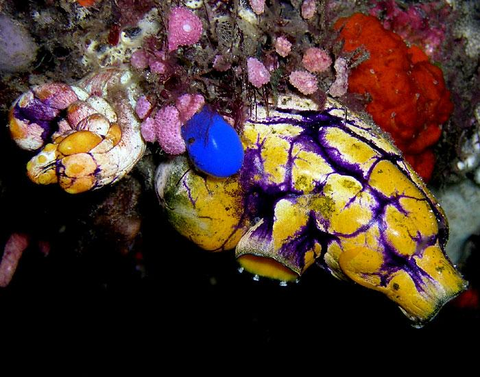
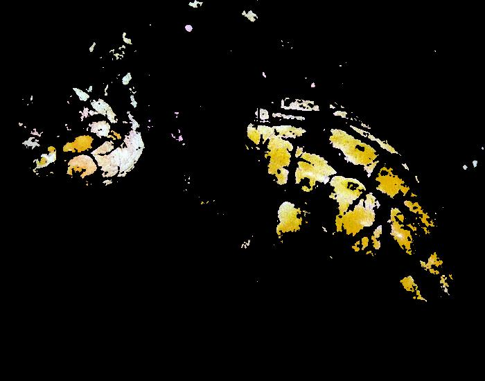
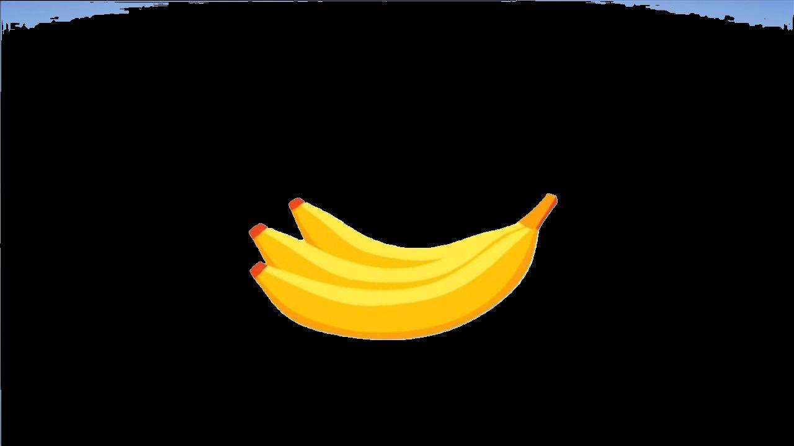
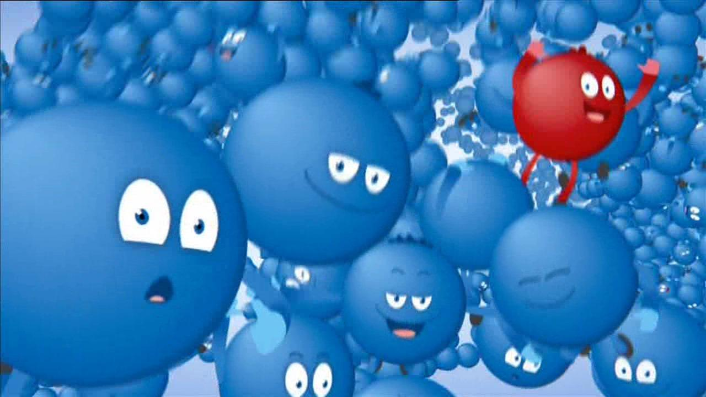
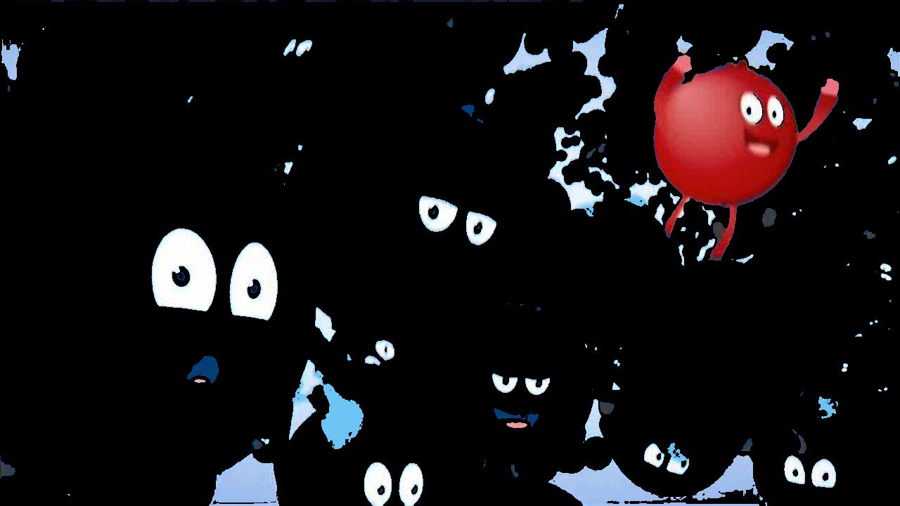
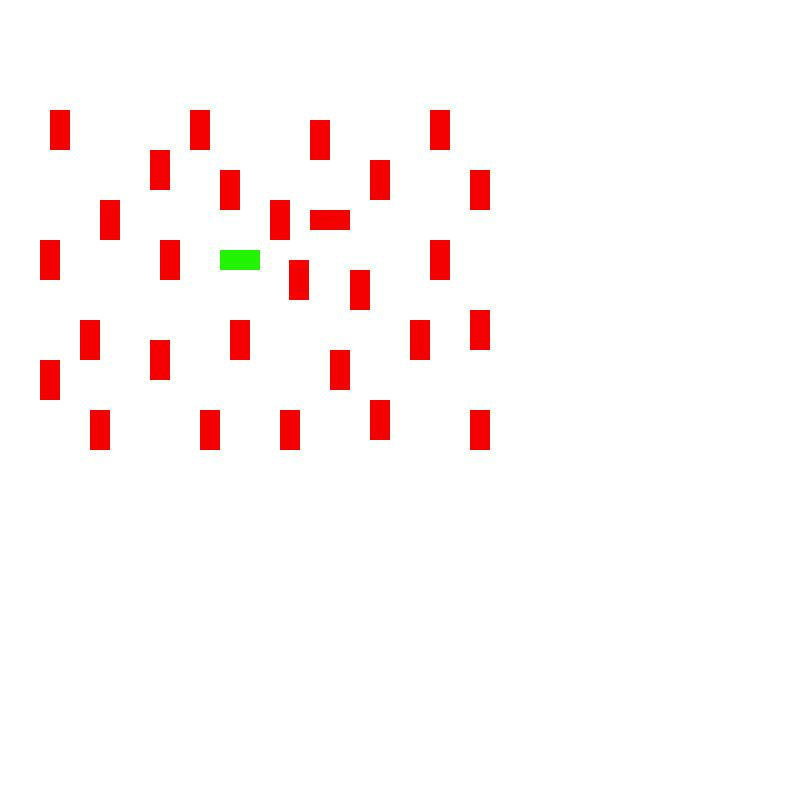
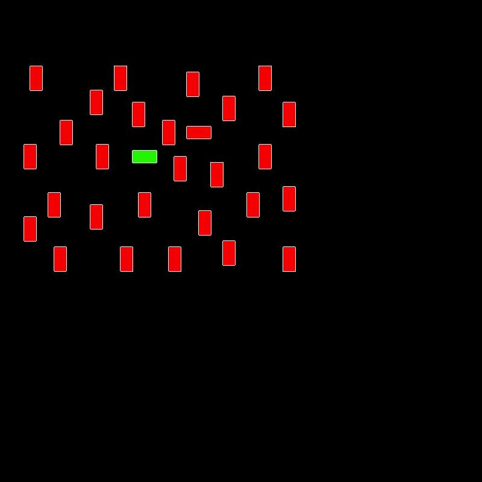
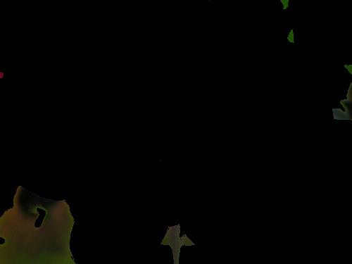

% Frequency-tuned Salient Region Detection
% Alexander Höreth and Sebastian Höffner
% November 6, 2016

# Frequency-tuned Salient Region Detection

Achanta et al.\ propose a saliency driven method for region detection. Instead of using a complex way of detecting saliency as for example in the original approach [@itti], they simplified it.

To obtain a saliency map $S$ of a given image $I$ Achanta et al.\ use a band-pass filter and an application of mean images in the lab color space. The lab color space is useful because of its properties in visual perception: the perceptual difference between two colors can be calculated using the Euclidean distance [@wikipedialab]. The saliency map is the Euclidean distance between each color channel in the lab color space.

In a first step the image is transformed to the lab color space. Then the saliency map is calculated. Achanta et al.\ use no Gaussian pyramid, but still a Difference of Gaussians (DoG) to apply a band-pass filter. They filter the image with a Gaussian filter such that they contain frequencies in the range $(0, \frac{\pi}{2.75}]$. For this they use $\sigma = 1.6$, which is needed for an ideal edge detector [@achanta]. The filtered image $I_{\omega}$ is subtracted from the mean image $I_{\mu}$. The Euclidean distance is calculated from the result, leading to the saliency map.

So the full algorithm is:

1. Convert the input image to lab color space.
2. Calculate the mean image $I_{\mu}$.
3. Filter the input image with a Gaussian filter of size 5x5 with $\sigma = 1.6$ to obtain $I_{\omega}$.
4. Subtract the filtered image from the mean image: $I_{\mu}-I_{\omega}$.
5. Calculate the Euclidean distance $S = ||I_{\mu}-I_{\omega}||$.

In order to extract the salient region, thresholding can be used. Achanta et al.\ try different thresholds between 0 and 255. They achieve best results with a threshold of $\theta = 200$. To apply it, an additional step is needed: Scaling the saliency map to that range.

6. $S_{scaled} = 255\frac{S}{S_{max}}$.

Plain thresholding is not very succesful. Instead, adaptive thresholding can be used. The adaptive threshold is twice the mean of the saliency map: $2S_{\mu}$. In addition, it is only applied on mean shifted images The algorithm thus changes slightly.

6. Apply mean-shift segmentation on the lab color space image.
7. Apply adaptive thresholding with $\theta = 2S_{\mu}$ on the saliency map.
8. Include those clusters from 6. for which the saliency is higher than the threshold.

# Application

Unfortunately the source code provided by Achanta et al.\ depends on some very specific C++ header files[^c++], only available in proprietary versions of Visual Studio[^sto]. Thus we were only able to use the authors' simplified Matlab code. It only supports the creation of the squared saliency map. We modified it to use static thresholding and adaptive thresholding. We were not able to apply the mean-shift segmentation, and as such our results come no where close to what the paper achieved in the adaptive thresholding case. Still both, the static as well as the adaptive thresholding, yield results good enough to identify some strengths and weaknesses of the approach.

[^c++]: [http://ivrlwww.epfl.ch/supplementary_material/RK_CVPR09/](http://ivrlwww.epfl.ch/supplementary_material/RK_CVPR09/)
[^sto]: [https://stackoverflow.com/questions/16227840/where-can-i-get-afx-h-files](https://stackoverflow.com/questions/16227840/where-can-i-get-afx-h-files)

## Results

Since the algorithm employs the Euclidean distance between the average image color and each pixel to calculate the saliency map, it is not surprising that it works best for images which have objects of a very different color than the background. This can be seen with the following sea squirt image[^seasquirt] (left original, right segmented version):

[^seasquirt]: Image taken from [wikipedia:Polycarpa aurata](https://en.wikipedia.org/wiki/Polycarpa_aurata)

{width=200}\ {width=200}

The clear yellow structure is segmentated, while the blue and violet tints, which come close to the average between the dark blue-blackish background in the bottom left and the read background in the top right of the image, are not included in the segmentation. This of course might be different if mean segmentation was applied first.

For images with a very clear background and foreground distinction the simple method already works pretty good, an example are artificial images:

{width=200}\ {width=200}

Here we can see a very clear separation between the blue background and the very distinct yellow bananas of the foreground.
But not all artificial images work equally well: In the following example only the very prominent red entity is segmented, alongside the others' eyes.

{width=200}\ {width=200}

For some tasks, which were solved with human level performance [@itti], this simplified saliency map is not powerful enough, as it does not take orientations into account. As an example take the following stimulus:

{width=200}\ {width=200}

The algorithm segments all elements very well, even with simple thresholding. But it is unable to distinguish between different item properties, thus unable to solve the task in finding outliers.

A very interesting phenomenom arises when the foreground object dominates the view area and is of a very homogenous color[^flower]. In this case the algorithm segments out the foreground.

[^flower]: Image taken from [flickr via ImageNet](https://farm4.static.flickr.com/3220/3555690726_4d876d7195.jpg)

{width=200}\ {width=200}

More images as well as their saliency maps can be found attached with the report.

# Conclusion

The presented method works very well for images which can be perceptually segmented by colors into fore- and background, especially if the foreground colors have a high distance to the mean image value. It works well for many artificial images and with sufficiently few clusters should work similar on real images. One caveat is that it can confuse fore- and background if the foreground item is too big.

# References

